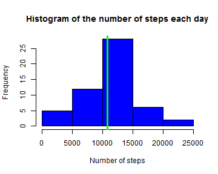
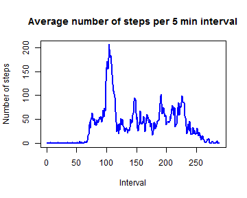

Reproducible Research: Peer Assessment 1
========================================================
## Loading and preprocessing the data


```r
dirProject <- "/Coursera/JohnsHopkins-Data-Science/5. Reproducible research/RepData_PeerAssessment1"
setwd(paste(setwd("~/"), dirProject, sep = "", collapse = NULL))
```

```
## Error: cannot change working directory
```

```r
## Download .zip file
fileURL <- "http://d396qusza40orc.cloudfront.net/repdata%2Fdata%2Factivity.zip"
download.file(fileURL, dest = "activity.zip")
## unzip and load into memory
fname <- unzip("activity.zip", list = FALSE)
activity <- read.csv(fname, header = TRUE)
```

The variables in *activity* are :

**steps**: Number of steps taking in a 5-minute interval (missing values are coded as NA)  
**date**: The date on which the measurement was taken in YYYY-MM-DD format  
**interval**: Identifier for the 5-minute interval in which measurement was taken

## Mean and median total number of steps taken per day

Ignore the missing values in the dataset.
Histogram of the total number of steps taken each day

```r
## numbers >= 10^5 will be denoted in scientific notation, and rounded to 2
## digits
options(scipen = 1, digits = 1)  #show 
steps <- aggregate(activity$steps, by = list(as.factor(activity$date)), FUN = sum)
colnames(steps) <- c("day", "Nsteps")
hist(steps$Nsteps, main = "Histogram of the number of steps each day", xlab = "Number of steps", 
    col = "blue")
abline(v = median(steps$Nsteps, na.rm = TRUE), col = "green", lwd = 3)
```

 

```r
meanSteps <- mean(steps$Nsteps, na.rm = TRUE)
medianSteps <- median(steps$Nsteps, na.rm = TRUE)
```

**Mean** total number of steps per day 10766.2.  
**Median** total number of steps per day 10765.  

## Average daily activity pattern


```r
intervals <- list(as.factor(activity$interval))
stepsInterval <- aggregate(activity$steps, by = intervals, FUN = mean, na.rm = TRUE)
colnames(stepsInterval) <- c("Interval", "Nsteps")
x <- as.numeric(stepsInterval$Interval)
plot(x, stepsInterval$Nsteps, type = "l", lwd = 2, main = "Average number of steps per 5 min interval", 
    xlab = "Interval", ylab = "Number of steps", col = "blue")
```

 

```r
maxInterval <- x[which.max(stepsInterval$Nsteps)]
```


The maximum number of steps, on average across all the days in the dataset, contains 5-minute interval number 104.  


