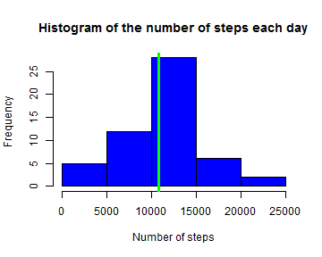
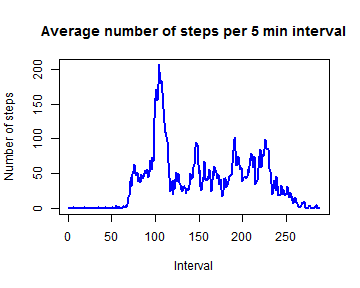
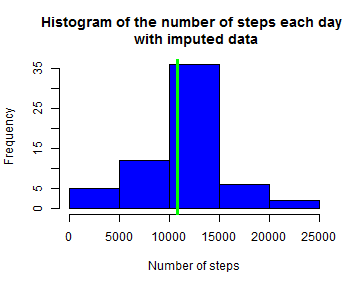
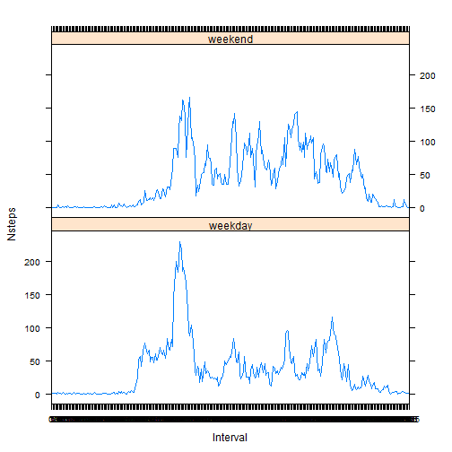

Reproducible Research: Peer Assessment 1
========================================================
## Loading and preprocessing the data


```r
## Download .zip file
fileURL <- "http://d396qusza40orc.cloudfront.net/repdata%2Fdata%2Factivity.zip"
download.file(fileURL, dest = "activity.zip")
## unzip and load into memory
fname <- unzip("activity.zip", list = FALSE)
activity <- read.csv(fname, header = TRUE)
```

The variables in *activity* are :

**steps**: Number of steps taking in a 5-minute interval (missing values are coded as NA)  
**date**: The date on which the measurement was taken in YYYY-MM-DD format  
**interval**: Identifier for the 5-minute interval in which measurement was taken

## Mean and median total number of steps taken per day

Ignore the missing values in the dataset.
Histogram of the total number of steps taken each day

```r
## numbers >= 10^5 will be denoted in scientific notation, and rounded to 2
## digits
options(scipen = 1, digits = 1)  #show 
steps <- aggregate(activity$steps, by = list(as.factor(activity$date)), FUN = sum)
colnames(steps) <- c("day", "Nsteps")
hist(steps$Nsteps, main = "Histogram of the number of steps each day", xlab = "Number of steps", 
    col = "blue")
abline(v = median(steps$Nsteps, na.rm = TRUE), col = "green", lwd = 3)
```

 

```r
meanSteps <- mean(steps$Nsteps, na.rm = TRUE)
medianSteps <- median(steps$Nsteps, na.rm = TRUE)
```

**Mean** total number of steps per day 10766.2.  
**Median** total number of steps per day 10765.  

## Average daily activity pattern

Create data frame *stepsInterval* with averaged number of steps for each interval.  


```r
intervals <- list(as.factor(activity$interval))
stepsInterval <- aggregate(activity$steps, by = intervals, FUN = mean, na.rm = TRUE)
colnames(stepsInterval) <- c("Interval", "Nsteps")
x <- as.numeric(stepsInterval$Interval)
plot(x, stepsInterval$Nsteps, type = "l", lwd = 2, main = "Average number of steps per 5 min interval", 
    xlab = "Interval", ylab = "Number of steps", col = "blue")
```

 

```r
maxInterval <- x[which.max(stepsInterval$Nsteps)]
```


The maximum number of steps, on average across all the days in the dataset, contains 5-minute interval number 104.

## Imputing missing variables

1. Copy *activity* frame to *activityImp*
2. Replace NAs in *activityImp* with the average number of steps for each interval from *stepsInterval*.


```r
# Make a logical vector *indexNA* of NAs
indexNA <- is.na(activity)
missingN <- sum(indexNA)
activityImp <- activity
for (i in 1:length(activityImp$steps)) {
    if (indexNA[i]) 
        activityImp$steps[i] = stepsInterval$Nsteps[stepsInterval$Interval == 
            activityImp$interval[i]]
}
```

Total of 2304 values were missing.
A histogram of the total number of steps taken each day with imputed data.

```r

stepsImp <- aggregate(activityImp$steps, by = list(as.factor(activityImp$date)), 
    FUN = sum)
colnames(stepsImp) <- c("day", "Nsteps")
hist(stepsImp$Nsteps, main = "Histogram of the number of steps each day \n with imputed data", 
    xlab = "Number of steps", col = "blue")
abline(v = median(stepsImp$Nsteps, na.rm = TRUE), col = "green", lwd = 3)
```

 

```r
meanStepsImp <- mean(stepsImp$Nsteps)
medianStepsImp <- median(stepsImp$Nsteps)
```

**Mean Imputed** total number of steps per day 10766.2.  
Same as **Mean** 10766.2.  
**Median Imputed** total number of steps per day 10766.2.  
Compare with **Median** 10765.

## Activity patterns on weekdays and weekends.

Create a new factor column in *activityImp* with "day" levels.  
Rename the days as "weekday" and "weekend".

```r
activityImp$day <- as.factor(weekdays(as.Date(activityImp$date)))
activityImp$day <- sub("Monday|Tuesday|Wednesday|Thursday|Friday", "weekday", 
    activityImp$day)
activityImp$day <- sub("Saturday|Sunday", "weekend", activityImp$day)
```

Create dataframe *stepsDay* with averaged number of steps for each interval for the weekdays and weekends.  


```r
## Create dataframe stepsWeekday
intervalsWeekday <- list(as.factor(activityImp$interval[activityImp$day == "weekday"]))
stepsWeekday <- with(activityImp, aggregate(steps[day == "weekday"], by = intervalsWeekday, 
    FUN = mean))
stepsWeekday$day <- factor("weekday")
intervalsWeekend <- list(as.factor(activityImp$interval[activityImp$day == "weekend"]))

## Create dataframe stepsWeekend
stepsWeekend <- with(activityImp, aggregate(steps[day == "weekend"], by = intervalsWeekend, 
    FUN = mean))
stepsWeekend$day <- factor("weekend")

## Combine the two sets
stepsDay <- rbind(stepsWeekday, stepsWeekend)
colnames(stepsDay) <- c("Interval", "Nsteps", "day")
```

Activity on the weekdays and weekends

```r
library(lattice)
x <- as.numeric(stepsDay$Interval)
with(stepsDay, xyplot(Nsteps ~ Interval | day, layout = c(1, 2), type = "l"))
```

 


